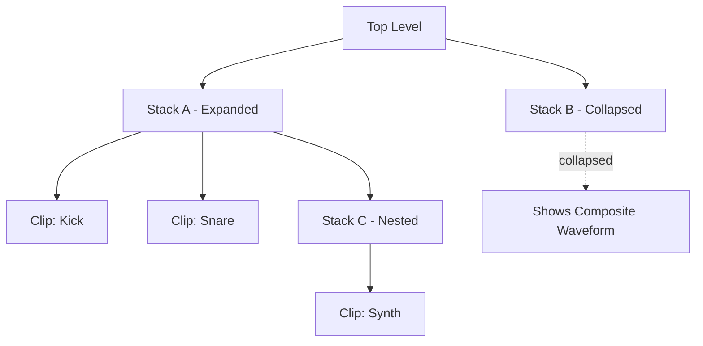

# Nesting and Stack Architecture

This document describes the refactored organizational structure of Celestrian, where "Stacks" are the primary container concept.

## 1. Terminology Clarification

**Important**: We are renaming "Box" to "Stack" throughout the codebase. `BoxNode` becomes `StackNode`.

- **Stack**: A container that holds a vertical column of **Clips** or other **Stacks** (nested).
- **Clip**: An individual audio recording/loop.

## 2. The Stack Concept

A **Stack** is both a visual and logical wrapper around a collection of nodes.

### Visual Representation

- **Border & Background**: A stack is rendered with a border and subtle background to distinguish it from other stacks.
- **Two States**:
    - **Expanded**: Shows all child nodes (Clips and nested Stacks) in a vertical layout.
    - **Collapsed**: Shows a single composite waveform representing the mixed-down audio of all children.

### Collapse/Expand Toggle

- **Control**: A minimize/expand handle appears at the top-right corner of the stack border.
- **Interaction**: Click the handle to toggle between expanded and collapsed states.
- **Collapsed Behavior**: 
    - The stack renders as a single "super-clip" with an aggregated waveform.
    - Loop regions can be set on the collapsed stack, affecting playback timing of all internal children as a unit.
    - All standard clip controls (loop handles, play, solo, mute) work on the collapsed stack.

### Stack Creation

- **"New Stack" Button**: Located at the top-left of the viewport, creates a new empty stack.
- **Stack (+) Button**: Each stack has a `(+)` button at the bottom (inside the border) with options:
    - **New Clip**: Adds a new recording clip to the stack.
    - **New Stack**: Adds a nested stack to the stack.
    - **Load Template**: (Future) Spawns a pre-configured stack of nodes.

## 3. Interaction & Reordering

To facilitate fluid arrangement, nodes are more manipulatable:

- **Grab Handles**: Each node (Clip or Stack) has a dedicated drag handle on its far left.
- **Reordering**: Users can grab a handle to drag a node up or down within its current stack.
- **Inter-Stack Movement**: Nodes can be dragged between different stacks at the same level.
- **Nesting via Drag**: Dragging a node onto a **Stack Node** will "drop" that node into the stack's children.

## 4. Deep Nesting (Future)

While the initial implementation focuses on a single level of stacks (always editing at the top level with expand/collapse), the architecture supports arbitrary nesting depth.

### Potential Future Navigation Approaches

For deeply nested stacks, we may want to implement one of the following:

1. **Breadcrumb Navigation**: A breadcrumb trail showing the current "path" of stacks.
2. **Tab/Context Switching**: Multiple viewport tabs, each focused on a different stack.
3. **Zoom-In Interaction**: Double-click an expanded stack to make it the "focused" context, with a "Back" button to return.
4. **Hierarchical Sidebar**: A tree view showing the full stack hierarchy.

**Current Decision**: Defer deep nesting navigation. For now, all editing happens at the top level, and users can expand/collapse stacks to manage complexity.

## 5. Implementation Notes

- **Backend**: `BoxNode` → `StackNode` throughout C++ codebase.
- **Metadata**: Stacks will have an `isExpanded` boolean to track UI state.
- **Rendering**: When collapsed, the stack renders a single waveform canvas using the stack's `getWaveform()` aggregate.
- **Audio Processing**: No change to audio graph processing—stacks always sum their children regardless of UI state.
- **Dragging**: Use custom event handlers to manage reordering and nesting.

## 6. Visual Hierarchy

